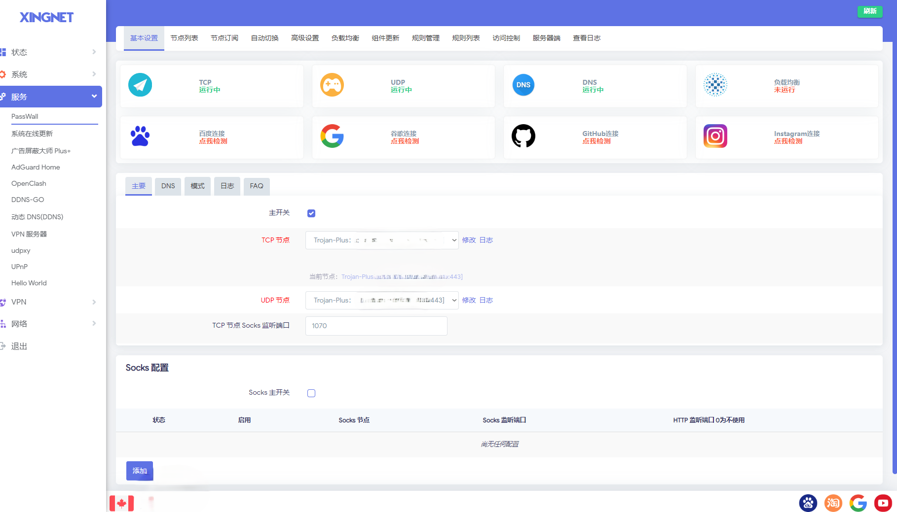
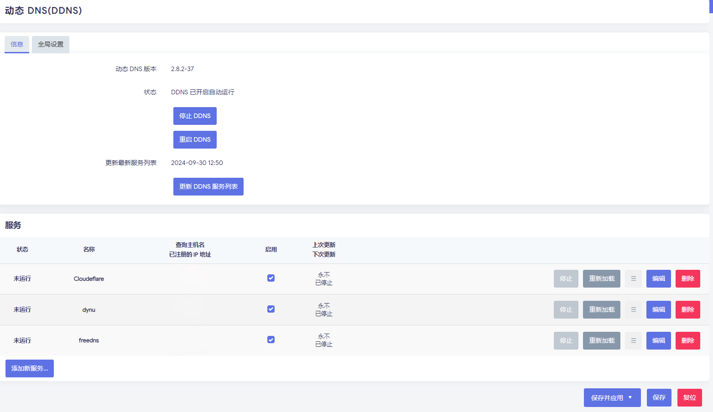
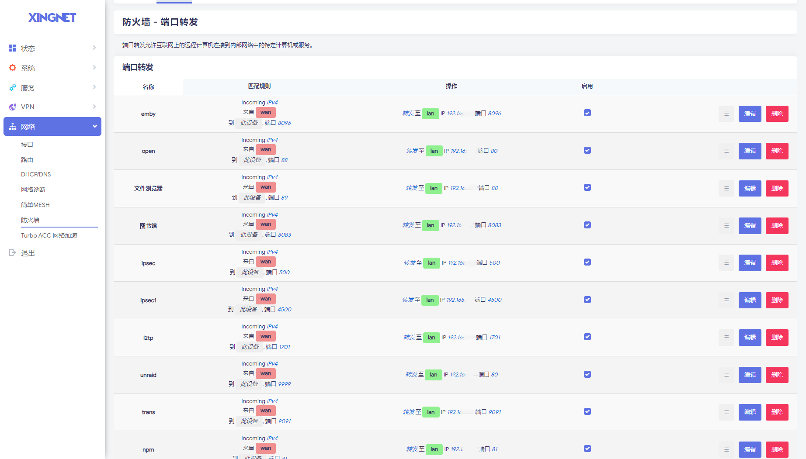
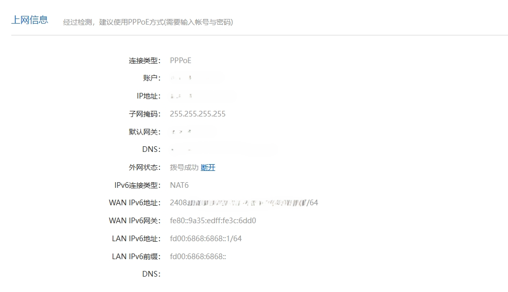
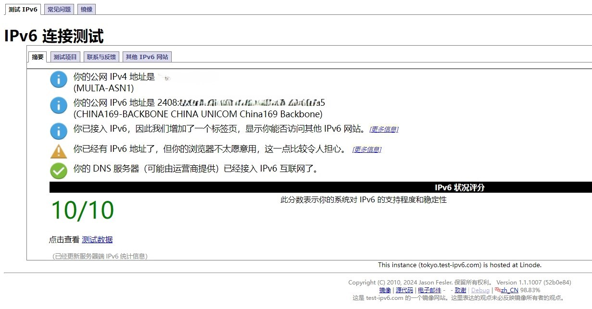

## Openwrt设置

### 网络概览

一直以来用的都是软路由

### 软路由系统

近期D2550因一次突然断电，寿终正寝了。然后就迎来了J1900，终于可以尽情的安装软路由。软路由系统选择

- [openwrt](https://github.com/openwrt/openwrt ) 原版系统，原汁原味。
- [ImmortalWrt](https://github.com/immortalwrt/immortalwrt "一款面向中国大陆用户的开源 OpenWrt 变体") 适合中国食用的改版系统，很可口，清爽。
- [KWRT](https://github.com/kiddin9/Kwrt) 另一个变体，这个是我用了几年的系统，当时是因为一直找不到合适的32位系统。这个系统很稳定，自带一些常用的软件，比如酸酸乳，怕死我，广告拦截等。
- [IKUAI](https://www.ikuai8.com/component/download)  装过一两次，具体不评论
- [iStore](https://github.com/linkease/istore)  官方定位，The iStore is a app store for OpenWRT。

### 科学工具

管用Passwall，DNS分流设置，都是随缘。

节点，VPS配合一键trojan，用的是[Jrohy](https://github.com/Jrohy)大佬的[trojan多用户管理部署程序](https://github.com/Jrohy/trojan)一键安装

### DDNS

ddns动态域名，用的是DDNS-go,配置的是阿里云。顺便申请了[Freedns](https://freedns.afraid.org)的二级域名(uk.to)，国内访问响应速度不错，用ddns直接配置的，DDNS-go不支持freedns。

<h3 id="port-forwarding">端口转发</h3>

端口转发，在防火墙这个选项内。因为是网络小白，光端口转发都摸索了好几天。还好现在有了chatgpt等ai工具，对于小白来说，上手难度降低了不少。

### 桥接or路由模式

我选择了光猫桥接，openwrt软路由负责拨号。

我遇到了IPV6下发的问题，lan口无法获得ipv6。因为联通给我下发的IPV6是只有2048::/64.没有ipv6-pd前缀的。我寻遍了网络，没有找到解决办法，只好用小米路由使用的这种NAT6的方式，向下游分发IPV6，且[ipv6测试](https://test-ipv6.com/index.html.zh_CN)凑活算是通过了。但是具体设置方法，我无法还原，因为lan口、wan6口、防火墙，我都做了不少改动，不知道具体哪些改动起了效果。

### 结语

总体来说，openwrt上手难度不低，不太适合我这种小白，需要折腾和学习的地方太多了。但是，谁让咱喜欢折腾呢。这是我写的第一篇正式意义的博客，自己捣鼓着在github page上发布自己的博客。至于写博客的原因，主要还是因为折腾的东西太多，总容易遗忘之前已经踩过的坑，导致二次踩坑。于是，觉得静下来，把自己的折腾之路记下来，再次碰到之前的问题，可以之间在这网站里快速寻找答案，避免二次或多次踩到同一个坑，以至浪费宝贵的生命。
